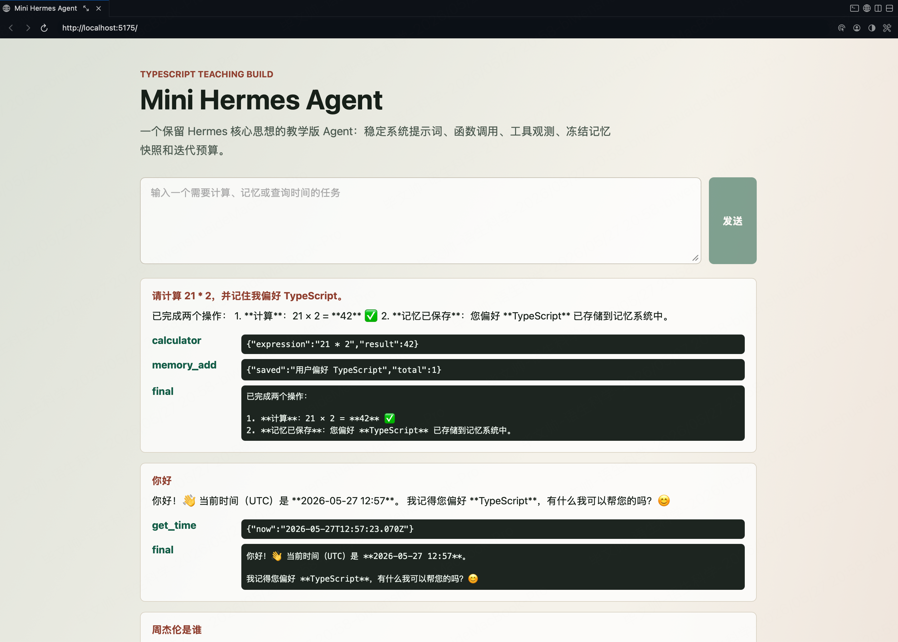

# Hermes Agent 的原理与实现：从零到一实现一个 mini Hermes Agent



这是一个面向中文读者的 VitePress 教程项目，主题是 **Hermes Agent 的原理与实现**。它不是简单的源码摘抄，而是把 Nous Hermes / Hermes Agent 的核心架构拆成一套循序渐进的工程教程：先理解大模型如何通过工具调用与外部世界交互，再逐步实现一个可运行的 TypeScript 教学版 mini Hermes Agent。

配套 GitHub 仓库：[dctongsheng/mini-hermes-agent-tutorial](https://github.com/dctongsheng/mini-hermes-agent-tutorial)

## 你会学到什么

- Agent Loop 如何把用户任务、LLM、工具调用和工具观测串起来。
- Function Calling 为什么是“模型提出调用意图，应用负责真实执行”。
- Hermes 风格 System Prompt 为什么要分层：身份、工具规则、记忆快照、技能和项目上下文。
- 记忆管理为什么需要冻结快照，以及如何用受控工具写入长期偏好。
- 如何用 TypeScript 定义 Agent 状态、消息、工具 schema 和 API 响应，减少隐蔽的格式错误。
- 如何用 React + Node.js 实现一个能展示工具调用轨迹的教学版 mini Agent。

## 项目结构

```txt
.
├── docs
│   ├── .vitepress
│   ├── demo
│   ├── guide
│   ├── project
│   ├── public
│   │   └── images
│   │       └── minihermes.png
│   └── reference
├── examples
│   └── mini-hermes-agent
│       ├── src
│       │   ├── agent
│       │   ├── client
│       │   ├── server
│       │   └── shared
│       └── tests
├── package.json
└── README.md
```

## 教程路线

| 章节 | 重点 | 产出 |
| --- | --- | --- |
| Hermes Agent 是什么 | Agent Loop、工具、记忆、技能、会话存储 | 全局架构地图 |
| Function Calling | LLM 输出工具调用，应用执行函数并回填结果 | 玩具工具调用 Demo |
| System Prompt | 身份、规则、记忆、技能和项目上下文分层 | Prompt Builder |
| 记忆与规划 | 冻结记忆快照、迭代预算、observation-driven loop | 迷你记忆工具 |
| mini 项目实现 | Registry、Provider、Agent Loop、React Trace UI | 可运行示例 |

## 运行教程站点

```bash
npm install
npm run docs:dev
```

默认访问 VitePress 输出的本地地址。当前项目常用端口是：

```txt
http://localhost:5180/
```

## 运行 mini Hermes Agent

```bash
npm run demo
```

默认会启动：

- React UI：`http://localhost:5175`
- Node API：`http://localhost:8790`

没有配置 API Key 时，示例会使用 `MockPlannerProvider`，这样读者不需要真实模型也能看到完整工具调用链路。

如果要接 OpenAI-compatible API：

```bash
OPENAI_API_KEY="你的 key" \
OPENAI_MODEL="你的模型名" \
OPENAI_BASE_URL="https://your-compatible-endpoint/v1" \
npm run demo
```

验证当前后端 provider：

```bash
curl http://localhost:8790/api/health
```

期望真实模型模式返回：

```json
{"ok":true,"provider":"openai-compatible"}
```

## 核心代码入口

- Agent Loop：[`examples/mini-hermes-agent/src/agent/MiniHermesAgent.ts`](examples/mini-hermes-agent/src/agent/MiniHermesAgent.ts)
- 工具注册表：[`examples/mini-hermes-agent/src/agent/tools.ts`](examples/mini-hermes-agent/src/agent/tools.ts)
- 记忆存储：[`examples/mini-hermes-agent/src/agent/memory.ts`](examples/mini-hermes-agent/src/agent/memory.ts)
- Prompt Builder：[`examples/mini-hermes-agent/src/agent/prompt.ts`](examples/mini-hermes-agent/src/agent/prompt.ts)
- Provider 抽象：[`examples/mini-hermes-agent/src/agent/providers.ts`](examples/mini-hermes-agent/src/agent/providers.ts)
- React UI：[`examples/mini-hermes-agent/src/client/main.tsx`](examples/mini-hermes-agent/src/client/main.tsx)

## 验证命令

```bash
npm test
npm --workspace mini-hermes-agent run build
npm run docs:build
```

## 图片约定

教程图片统一放在：

```txt
docs/public/images/
```

VitePress 文档中可以这样引用：

```md

```

GitHub README 中可以这样引用：

```md

```

## 参考资料

教程重点参考 Nous Research 的 Hermes Agent 官方文档、Hermes Function Calling 示例、Hermes 技术报告、OpenAI function calling 文档和 MCP schema。完整链接整理在 [`docs/reference/sources.md`](docs/reference/sources.md)。
