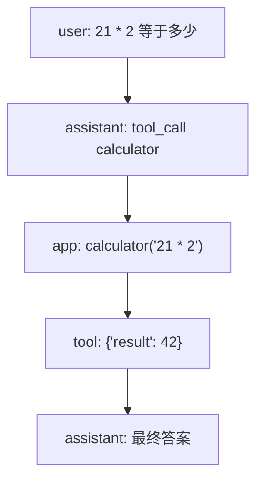

# Demo 1：先手写一个玩具工具调用循环

在进入完整 Agent 前，我们先写最小闭环。目标不是接真实模型，而是把协议跑通：

1. 用户提出任务。
2. “模型”返回工具调用请求。
3. 应用执行工具。
4. 应用把工具结果交回“模型”。
5. “模型”生成最终答案。

## 玩具版本的数据结构

```ts
type ToolCall = {
  id: string;
  name: string;
  arguments: Record<string, unknown>;
};

type Message =
  | { role: 'user'; content: string }
  | { role: 'assistant'; content: string; toolCalls?: ToolCall[] }
  | { role: 'tool'; toolCallId: string; content: string };
```

这个结构已经足够说明 Agent 的核心：工具调用不是普通文本，而是一种可执行的中间消息。

## 最小流程图



## 为什么不用 `eval`

教学 demo 中的 `calculator` 只接受数字和基础运算符。真实产品里，任何可执行工具都要更严格：

- 文件工具要限制工作目录。
- 终端工具要有危险命令审批。
- HTTP 工具要设置超时和域名白名单。
- 数据库工具要避免任意 SQL。

Hermes 的工具运行时文档里有 dangerous command approval 设计，说明成熟 Agent 必须把权限控制放在应用层，而不是指望模型自觉。

## 小练习

把 `calculator` 换成 `json_query`：

- 输入：`path`，例如 `user.name`。
- 内置数据：`{ user: { name: "Ada" } }`。
- 输出：路径对应的值。

思考：如果模型传入 `user.password`，应用应该返回什么？
