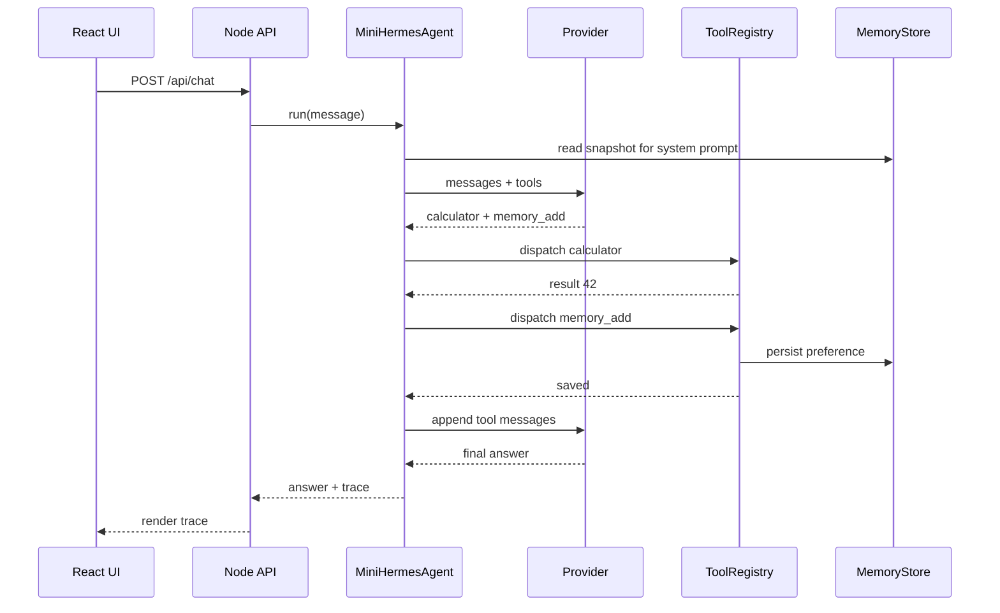

# Demo 2：把工具调用升级成 Agent Loop

玩具 Demo 只跑一次工具。真实任务常常需要多轮：先搜索，再读取，再计算，再保存记忆。Agent Loop 的职责就是持续执行：

```ts
for (let iteration = 0; iteration < maxIterations; iteration += 1) {
  const response = await provider.complete({ messages, tools, systemPrompt });

  if (response.toolCalls?.length) {
    messages.push({ role: 'assistant', content: '', toolCalls: response.toolCalls });
    for (const call of response.toolCalls) {
      const result = await registry.dispatch(call.name, call.arguments, context);
      messages.push({ role: 'tool', toolCallId: call.id, content: result });
    }
    continue;
  }

  return response.content;
}
```

## Agent Loop 的三个不变量

| 不变量 | 解释 |
| --- | --- |
| 历史消息必须合法 | assistant tool_call 后面要接 tool result |
| 工具结果必须可回填 | 不把异常抛出循环，而是包装成模型可读结果 |
| 循环必须有预算 | 没有 maxIterations 就可能无限调用 |

## mini 项目的消息时序



## Trace 为什么重要

如果只展示最终答案，读者看不到 Agent 到底做了什么。Trace 至少要包含：

- 工具名。
- 参数。
- 工具结果。
- 最终回答。

调试 Agent 时，Trace 比“模型解释自己做了什么”更可信，因为 Trace 来自应用侧执行记录。

## 小练习

给 Agent Loop 增加一个 `onStep` callback，把每次工具调用实时推送给前端。你可以用：

- 简单轮询。
- Server-Sent Events。
- WebSocket。

教学项目建议先用 SSE，因为它比 WebSocket 更轻。
