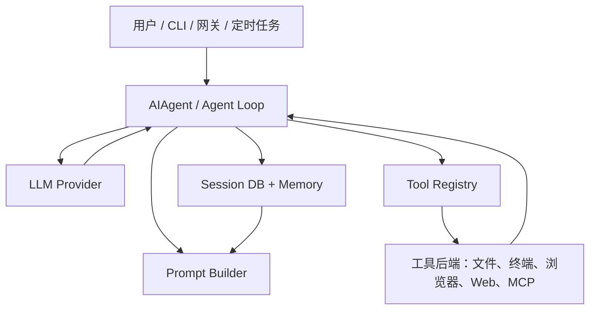
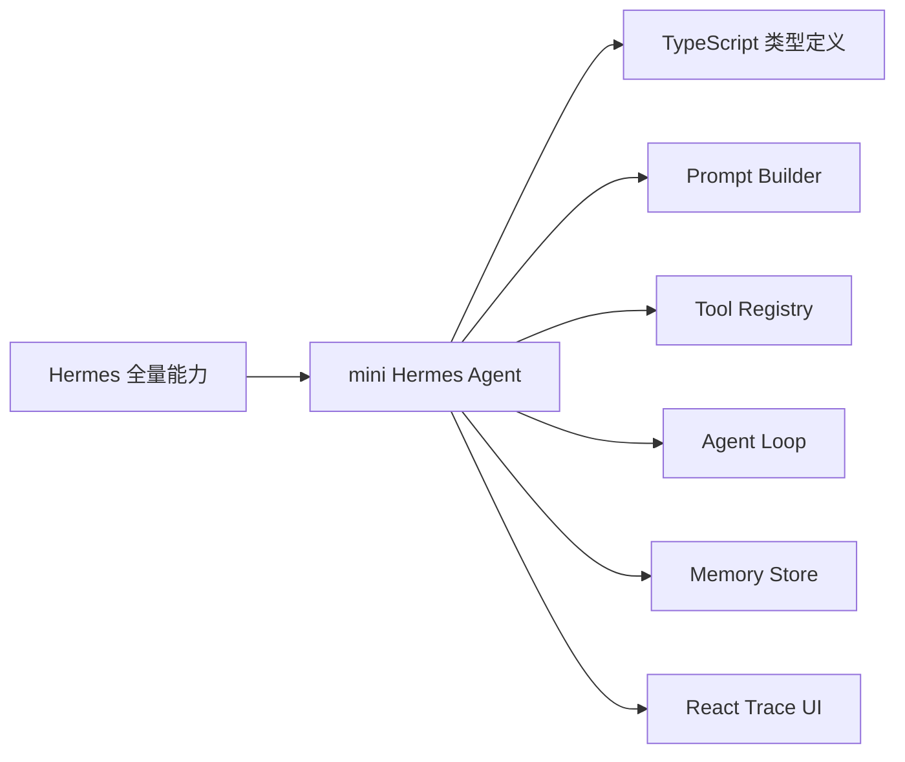

# Hermes Agent 是什么：把 LLM 放进一个可行动的工程外壳

Hermes Agent 的核心不是某一个神秘 Prompt，而是一条长期运行的工程链路：入口层接收用户任务，Agent Loop 调模型，模型决定是否调用工具，工具结果回填上下文，最终回答被保存到会话和记忆系统中。Nous 的官方架构文档把核心类放在 `AIAgent`，并把 Prompt Builder、Provider Resolution、Tool Dispatch、Session Storage、Tool Backends 作为主干模块。

## 先把 Agent 看成一个操作系统进程

一个普通聊天机器人只需要：

1. 把用户消息发给模型。
2. 拿到文本回复。
3. 展示给用户。

而一个 Hermes 风格 Agent 至少还要处理：

| 问题 | 工程模块 | 为什么需要 |
| --- | --- | --- |
| 模型不知道实时世界 | Tools / Function Calling | 通过应用侧函数访问外部数据和动作 |
| 模型上下文会爆 | Context Compression | 压缩中间历史，保留最近关键消息 |
| 对话结束后会遗忘 | Memory / Session Storage | 保存长期偏好、项目事实、完整历史 |
| 工具太多会污染上下文 | Toolsets / Registry | 按平台和任务裁剪可见工具 |
| 系统提示词越写越乱 | Prompt Builder | 把身份、规则、记忆、技能、项目上下文分层 |
| 多步任务容易失控 | Planning / Budget | 用 todo、迭代预算、工具观测约束循环 |

这就是本教程 mini 项目的设计原则：不是复刻 Hermes 全量功能，而是保留核心思想。

## Hermes 的关键设计

Hermes 官方文档中值得学习的几个工程判断：

- **平台无关核心**：CLI、Gateway、Cron、ACP 都进入同一个 Agent Loop。平台差异留在入口层，Agent 核心只关心消息、工具、模型和状态。
- **工具注册表**：工具模块自注册，Registry 负责收集 schema、检查可用性、分发调用、包装错误。
- **稳定 Prompt 前缀**：身份、工具规则、记忆快照、技能索引、项目上下文按固定顺序组装，减少缓存失效和语义漂移。
- **冻结记忆快照**：会话开始时把记忆注入 Prompt；会话中写入磁盘，但不立刻修改已缓存的系统提示词。
- **会话可检索**：SQLite + FTS5 保存消息，支持跨会话召回。

## 我们的 mini 版本保留什么

我们不会实现：

- 多平台消息网关。
- 真正的浏览器/终端沙箱。
- SQLite FTS5 全文检索。
- 多 Agent 委派。
- MCP 动态发现。

但你会学到这些能力应该挂在哪里。后续扩展时，不会把所有逻辑塞进一个 `chat()` 函数。

## 小练习

请你先用一句话描述：在 Agent 系统里，“模型”和“应用程序”分别负责什么？

参考答案：

- 模型负责根据上下文选择下一步：回答、调用工具、继续规划。
- 应用程序负责提供真实能力：执行函数、读写状态、校验参数、控制权限、保存历史。
