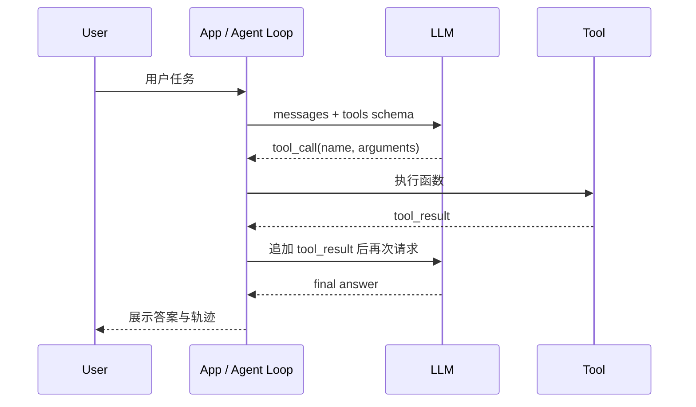

# Function Calling：让模型提出动作，让应用负责执行

Function Calling 的关键点：模型不直接执行函数，它只输出一个结构化的“调用请求”。真正执行函数的是你的应用程序。OpenAI 的官方文档把 tool calling 描述成五步：带工具请求模型、收到工具调用、应用执行代码、把工具结果回填模型、模型生成最终答案或继续调用工具。

## 五步循环



## Hermes Function Calling 的 XML 包装

Nous 的 Hermes Function Calling 示例使用 ChatML，并把可用工具放在 `<tools>` 标签内，模型返回 `<tool_call>` 标签包裹的 JSON：

```xml
<tool_call>
{"name": "get_stock_fundamentals", "arguments": {"symbol": "TSLA"}}
</tool_call>
```

这背后有两个核心思想：

1. **工具描述必须结构化**：函数名、描述、参数 schema 要足够清楚。
2. **工具结果要作为新消息回填**：模型需要看到 observation，才能生成可靠最终回答。

现代 OpenAI-compatible API 通常不需要你手写 XML；你直接把 `tools` 数组交给 API，SDK 会解析 `tool_calls`。但理解 XML 版本很有价值，因为它让你看清底层协议：这本质上还是“模型输出结构化文本，应用解析并执行”。

## 一个最小 TypeScript schema

```ts
const calculatorTool = {
  type: 'function',
  function: {
    name: 'calculator',
    description: 'Evaluate a small arithmetic expression.',
    strict: true,
    parameters: {
      type: 'object',
      properties: {
        expression: {
          type: 'string',
          description: 'For example "21 * 2".'
        }
      },
      required: ['expression'],
      additionalProperties: false
    }
  }
};
```

为什么这里坚持 `strict: true` 和 `additionalProperties: false`？

- 限制模型只能给出你声明过的字段。
- 让 TypeScript/Zod 的应用侧校验更有意义。
- 降低“模型多塞一个看似合理但业务不认识的参数”的概率。

## Function Calling 不是魔法

| 误解 | 更准确的说法 |
| --- | --- |
| 模型会调用函数 | 模型输出调用意图，应用调用函数 |
| schema 写了就绝对安全 | schema 只约束形状，权限和副作用仍要应用控制 |
| 工具越多越强 | 工具越多，Prompt 越长，选择越难，成本越高 |
| 工具结果可以随便写 | 工具结果是模型后续推理的事实输入，应可解析、简洁、带错误信息 |

## 常见踩坑

- **忘记追加 assistant tool_calls 消息**：很多 API 要求先有 assistant 的 tool call，再跟 tool role 的结果。
- **参数不做二次校验**：模型输出符合 JSON，不代表业务上合法。
- **工具错误直接抛异常**：Agent Loop 应把错误包装成 JSON，让模型有机会恢复。
- **把长文档塞进工具描述**：工具 schema 会计入上下文，描述要短而准。

## 小练习

设计一个 `weather` 工具 schema，只允许传入 `city` 和 `unit`，其中 `unit` 只能是 `celsius` 或 `fahrenheit`。思考：如果用户没说单位，你希望模型猜，还是让模型追问？
