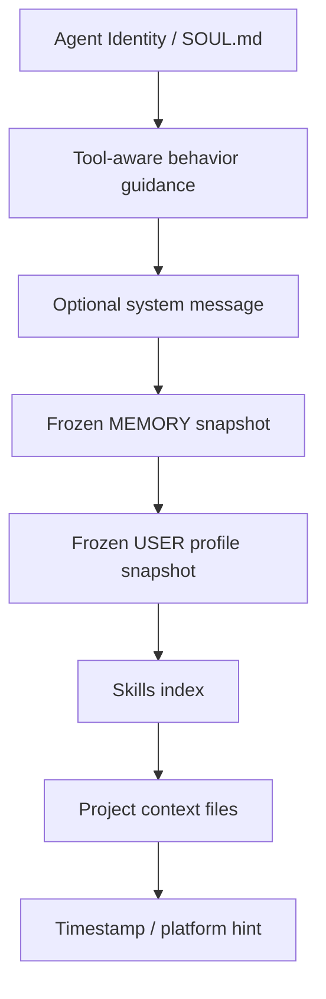

# System Prompt：不要写成一坨，要像配置系统一样分层

Hermes 的 Prompt Assembly 文档强调一个关键拆分：**缓存的系统提示词状态** 和 **每次 API 调用才追加的临时层** 要分开。这不是洁癖，是为了同时解决 token 成本、缓存命中、记忆语义和会话连续性。

## Hermes 风格的 Prompt 层次



用工程语言说：Prompt Builder 是一个纯函数入口，负责把多个稳定来源拼成一个可解释、可测试的字符串。

## 为什么要分层

| 层 | 变化频率 | 作用 |
| --- | --- | --- |
| Identity | 很低 | 定义 Agent 是谁、沟通方式、基本职责 |
| Tool Rules | 低 | 告诉模型什么时候该行动，如何处理工具结果 |
| Memory Snapshot | 会话间变化 | 注入长期事实，但会话中保持冻结 |
| Skills Index | 中 | 告诉模型有哪些可按需加载的流程文档 |
| Project Context | 项目变化 | 注入仓库规则、运行方式、代码约束 |
| Ephemeral Overlay | 每轮变化 | 加预算警告、临时平台上下文、当前轮提示 |

如果全部混在一个巨大字符串里，后果通常是：

- 每次小改动都会破坏缓存。
- 模型不知道哪些信息是长期事实，哪些只是本轮提示。
- 记忆更新时语义混乱：到底当前轮能不能看到新记忆？
- 调试困难：你无法定位行为变化来自哪一层。

## mini 项目的 Prompt Builder

本项目的简化实现位于 `examples/mini-hermes-agent/src/agent/prompt.ts`：

```ts
export async function buildHermesStyleSystemPrompt(inputs: PromptInputs): Promise<string> {
  const memories = await inputs.memory.list();
  const toolNames = inputs.tools.map((tool) => tool.function.name).join(', ');

  return [
    '# Identity',
    'You are Mini Hermes Agent, a teaching-oriented autonomous assistant.',
    '',
    '# Tool Use Rules',
    'Use tools when they provide fresher data, external actions, calculation, or persistent recall.',
    `Available tools: ${toolNames || 'none'}.`,
    '',
    '# Memory Snapshot',
    memories.length > 0 ? memories.map((entry) => `- ${entry}`).join('\n') : '- No durable memories yet.'
  ].join('\n');
}
```

这里刻意做得朴素：先把边界讲清楚，再谈复杂策略。

## Prompt 设计的实战建议

1. 把“身份”写成长期稳定的行为约束，不要塞任务细节。
2. 工具规则要写清楚：什么时候用工具、工具结果是否可信、失败怎么处理。
3. 记忆只放稳定事实，不放临时任务过程。
4. 项目规则从文件读入，不要写死在代码模板里。
5. 动态预算提醒放在 ephemeral 层，不要污染缓存前缀。

## 小练习

把下面这句话拆成更好的 Prompt 分层：

> 你是一个能写代码的 Agent，记得我喜欢 TypeScript，本项目用 pnpm，当前任务是修复登录 bug，如果工具失败就解释原因。

参考拆法：

- Identity：你是一个能写代码的 Agent。
- Memory：用户喜欢 TypeScript。
- Project Context：本项目用 pnpm。
- User Message：当前任务是修复登录 bug。
- Tool Rule：如果工具失败，解释原因并给下一步。
