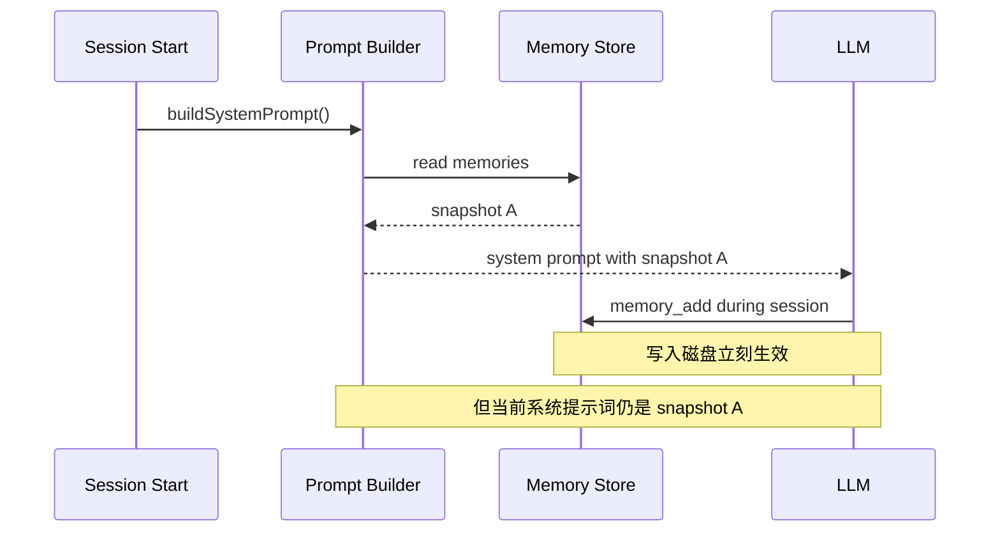

# 记忆管理与任务规划：让 Agent 不只会“当场反应”

Hermes 的 Persistent Memory 文档把记忆拆成两个文件：`MEMORY.md` 存 Agent 的环境事实、项目约定和经验；`USER.md` 存用户偏好、沟通风格和期望。它们在会话开始时被注入 System Prompt，并且是冻结快照。

## 记忆为什么要冻结



冻结不是偷懒，而是为了：

- 保持系统 Prompt 前缀稳定，提升缓存收益。
- 避免同一轮对话里“Prompt 自己变了”导致推理不可复现。
- 让记忆语义清晰：新记忆从下一次会话开始成为背景事实。

## 记忆应该写什么

| 适合写入 | 不适合写入 |
| --- | --- |
| 用户长期偏好 | 当前临时问题的中间输出 |
| 项目路径、常用命令 | 大段日志 |
| 环境约束 | 敏感凭证 |
| 工具使用经验 | 模型自己的猜测 |
| 稳定业务术语 | 需要核实的短期新闻 |

## 任务规划能力从哪里来

很多人以为规划能力全靠模型“聪明”。工程上更可靠的做法是给 Agent 外壳加入三个约束：

1. **Todo / Plan State**：把多步任务显式化，便于恢复和展示。
2. **Iteration Budget**：防止模型无限循环调用工具。
3. **Observation-driven Loop**：每次工具结果回来后重新判断下一步，而不是一次性计划到底。

Hermes 官方 Agent Loop 文档提到它会跟踪迭代预算，工具调用后把结果追加到历史，再循环回模型调用。我们的 mini 项目也保留了这个骨架。

## mini 项目的记忆工具

```ts
registry.register({
  name: 'memory_add',
  description: 'Persist one durable user preference, project fact, or environment note.',
  parameters: objectSchema(
    {
      content: {
        type: 'string',
        description: 'One compact memory entry.'
      }
    },
    ['content']
  ),
  async handler(args, context) {
    const { content } = memoryAddArgs.parse(args);
    const entries = await context.memory.add(content);
    return JSON.stringify({ saved: content, total: entries.length });
  }
});
```

注意这里有两个边界：

- 模型只能提出 `memory_add` 调用。
- 应用侧负责校验、去重、写文件、返回结构化结果。

## 常见踩坑

- **把记忆当数据库**：记忆是 Prompt 预算内的高价值摘要，不是无限存储。
- **让模型自己读写任意文件**：记忆工具应该是受控接口。
- **会话中立刻重建 System Prompt**：看似实时，实际会破坏缓存和可解释性。
- **没有预算**：工具调用失败时，模型可能反复尝试同一个坏参数。

## 小练习

为 `memory_add` 增加一个 `target` 字段，允许写入 `memory` 或 `user_profile`。你需要改哪些地方？

- TypeScript 类型。
- JSON Schema。
- Zod 校验。
- MemoryStore 存储结构。
- Prompt Builder 注入格式。
