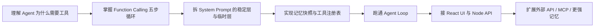

# Hermes Agent 的原理与实现：从零到一实现一个 mini Hermes Agent

这套教程的目标不是“读一遍 Hermes 源码”。真正要学会的是：一个能行动、能记忆、能规划的 Agent，究竟由哪些工程模块拼出来；每个模块解决什么问题；为什么不能只靠一个大 Prompt 硬撑。配套源码已经放在 [GitHub 仓库 dctongsheng/mini-hermes-agent-tutorial](https://github.com/dctongsheng/mini-hermes-agent-tutorial)，阅读每一章时都可以把文档和仓库代码并排打开。

我们会参考 Nous Research 的 Hermes Agent、Hermes Function Calling 模板、Hermes 3/4 技术报告，以及 OpenAI function calling 的通用接口，把复杂系统压缩成一个适合本科毕业生和初级开发者复现的教学版项目。教程中的 mini 实现不是伪代码，你可以直接在 [GitHub 上查看完整目录](https://github.com/dctongsheng/mini-hermes-agent-tutorial/tree/main/examples/mini-hermes-agent)。


## 你会做出什么

最终项目在 [`examples/mini-hermes-agent`](https://github.com/dctongsheng/mini-hermes-agent-tutorial/tree/main/examples/mini-hermes-agent)：

- 前端：React + Vite，显示用户消息、最终回答、工具调用轨迹。
- 后端：Node.js + Express + TypeScript，暴露 `/api/chat`。
- Agent 核心：稳定 System Prompt、工具注册表、函数调用循环、记忆存储、迭代预算。
- Provider：默认 Mock LLM，可无 Key 演示完整链路；配置 `OPENAI_API_KEY` 后切到 OpenAI-compatible tool calling。

## 学习路线



## 课程结构

| 章节 | 你会学到什么 | 产出 |
| --- | --- | --- |
| Hermes Agent 是什么 | Agent loop、工具、记忆、技能、会话存储的总体架构 | 一张全局地图 |
| Function Calling | LLM 如何提出工具调用，应用如何执行并回填结果 | 一个玩具工具调用 Demo |
| System Prompt | 为什么 Hermes 把身份、工具规则、记忆、技能、项目上下文分层 | 可维护的 Prompt Builder |
| 记忆与规划 | 冻结记忆快照、session search、todo/iteration budget 的价值 | 迷你记忆工具 |
| mini 项目实现 | TypeScript 类型定义、Registry、Agent Loop、Provider、UI | 可运行项目 |

## 推荐阅读方式

先读 `核心原理`，不要急着抄代码。Agent 工程最容易踩的坑不是语法，而是“模型、应用状态、外部工具”三者之间的边界不清。理解边界之后，代码会非常顺。

然后运行：

```bash
npm install
npm run docs:dev
npm run demo
```

默认 demo 不需要 API Key。它会用 Mock LLM 模拟工具调用，帮助你看清 Agent Loop 的骨架。

如果你想直接从仓库开始，可以打开 [README](https://github.com/dctongsheng/mini-hermes-agent-tutorial#readme) 查看安装、运行、真实模型配置和核心文件入口。
