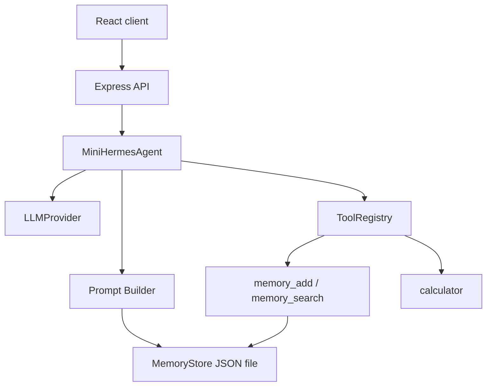

# 最终项目架构：TypeScript mini Hermes Agent

本项目的代码在本地 `examples/mini-hermes-agent`，也可以直接到 GitHub 查看同一份源码：[examples/mini-hermes-agent](https://github.com/dctongsheng/mini-hermes-agent-tutorial/tree/main/examples/mini-hermes-agent)。

```txt
examples/mini-hermes-agent
├── src
│   ├── agent
│   │   ├── MiniHermesAgent.ts
│   │   ├── memory.ts
│   │   ├── prompt.ts
│   │   ├── providers.ts
│   │   └── tools.ts
│   ├── client
│   │   ├── main.tsx
│   │   └── styles.css
│   ├── server
│   │   └── index.ts
│   └── shared
│       └── types.ts
└── tests
    └── agent.test.ts
```

## 模块边界



## 每个模块负责什么

| 文件 | 责任 | 不做什么 |
| --- | --- | --- |
| [`shared/types.ts`](https://github.com/dctongsheng/mini-hermes-agent-tutorial/blob/main/examples/mini-hermes-agent/src/shared/types.ts) | Agent 消息、工具、Trace、API 响应类型 | 不包含业务逻辑 |
| [`agent/tools.ts`](https://github.com/dctongsheng/mini-hermes-agent-tutorial/blob/main/examples/mini-hermes-agent/src/agent/tools.ts) | 注册工具、导出 OpenAI schema、分发调用 | 不决定何时调用工具 |
| [`agent/memory.ts`](https://github.com/dctongsheng/mini-hermes-agent-tutorial/blob/main/examples/mini-hermes-agent/src/agent/memory.ts) | 读写 durable memory | 不直接修改 Prompt |
| [`agent/prompt.ts`](https://github.com/dctongsheng/mini-hermes-agent-tutorial/blob/main/examples/mini-hermes-agent/src/agent/prompt.ts) | 组装稳定 System Prompt | 不执行工具 |
| [`agent/providers.ts`](https://github.com/dctongsheng/mini-hermes-agent-tutorial/blob/main/examples/mini-hermes-agent/src/agent/providers.ts) | Mock 或真实 LLM 调用 | 不保存状态 |
| [`agent/MiniHermesAgent.ts`](https://github.com/dctongsheng/mini-hermes-agent-tutorial/blob/main/examples/mini-hermes-agent/src/agent/MiniHermesAgent.ts) | Agent Loop 编排 | 不关心 HTTP/React |
| [`server/index.ts`](https://github.com/dctongsheng/mini-hermes-agent-tutorial/blob/main/examples/mini-hermes-agent/src/server/index.ts) | HTTP API | 不实现 Agent 细节 |
| [`client/main.tsx`](https://github.com/dctongsheng/mini-hermes-agent-tutorial/blob/main/examples/mini-hermes-agent/src/client/main.tsx) | 展示交互和 Trace | 不直接调用工具 |

## 为什么这样拆

初学者写 Agent 常犯的第一个错误，是把所有东西写进一个 `chat()`：

```ts
async function chat(input: string) {
  const prompt = '...';
  const tools = [...];
  const response = await model(...);
  if (response.tool_calls) {
    // 执行工具、写记忆、拼历史、返回 UI
  }
}
```

这种写法前 50 行很舒服，超过 300 行就开始痛苦。原因是它混合了四类变化：

- Prompt 策略变化。
- 工具集合变化。
- Provider API 变化。
- UI/API 展示变化。

Hermes 的官方架构把这些拆开，mini 项目也照着这个方向设计。

## 数据流

1. React 发起 `POST /api/chat`。
2. Express 调用 `agent.run(message)`。
3. Agent 首次运行时构建冻结 System Prompt。
4. Agent 把 messages 和 tools schema 发给 Provider。
5. Provider 返回 tool calls 或 final answer。
6. Agent 通过 Registry 执行工具，追加 tool messages。
7. 循环直到 final answer 或达到预算。
8. API 返回答案、Trace、完整消息。

## 小练习

如果你要增加 `web_search` 工具，应该优先改哪个文件？

答案：先改 `agent/tools.ts` 注册工具和 schema；如果需要 API Key，再在 server 层读取环境变量。不要让 React 直接访问搜索 API。
